# slidev-theme-bestony2026

[](https://www.npmjs.com/package/slidev-theme-bestony2026)

**Crimson Deck** — a dark, crimson-accented [Slidev](https://github.com/slidevjs/slidev)
theme for technical reviews and product updates. Deep black surfaces, a single
crimson accent, Noto Sans SC for Chinese and JetBrains Mono for numbers/labels.
Ships **27 layouts**, 8 themed ECharts chart types, and crimson-styled Mermaid /
PlantUML / code blocks.

## Preview

<table>
  <tr>
    <td width="50%"></td>
    <td width="50%">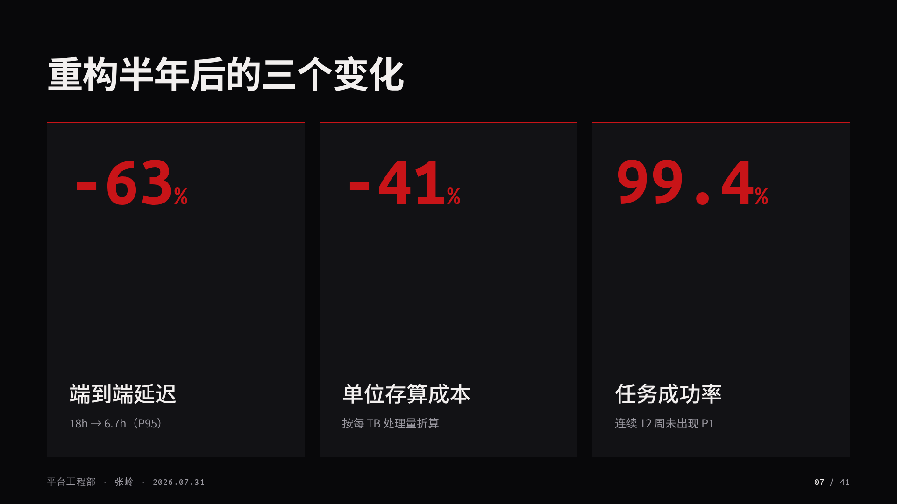</td>
  </tr>
  <tr>
    <td>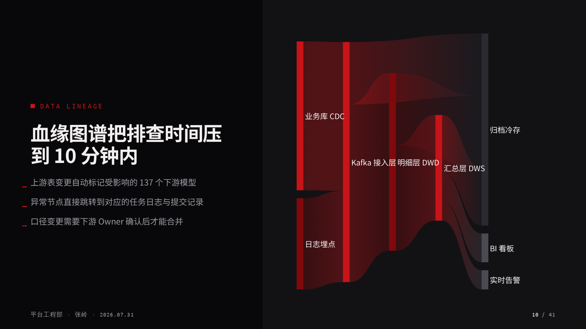</td>
    <td></td>
  </tr>
  <tr>
    <td></td>
    <td></td>
  </tr>
  <tr>
    <td>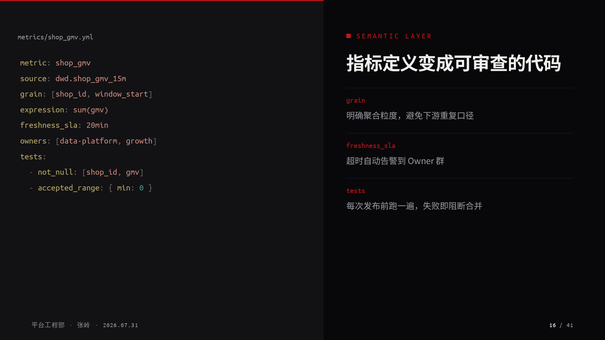</td>
    <td></td>
  </tr>
</table>

<sub>Rendered from <a href="./example.md"><code>example.md</code></a> at 1920×1080. See it live with <code>pnpm dev</code>.</sub>

## Install

Add the theme to your slides' headmatter — Slidev will prompt to install it:

```yaml
---
theme: bestony2026
canvasWidth: 1920
---
```

> **Important:** this theme is designed on a **1920×1080** canvas. Set
> `canvasWidth: 1920` in your headmatter so every layout renders at the intended
> proportions. (The bundled `example.md` sets it for you.)

## Accent color

Set one color. The rest of the palette — the dark and light stops, the glow
alphas, the chart ramps, the Mermaid theme and the ink on full-accent slides —
is derived from it.

```yaml
---
theme: bestony2026
canvasWidth: 1920
themeConfig:
  primary: '#1E6FD9'   # hex, rgb(), hsl(), oklch(), or a named color
---
```

Nothing but `primary` differs between these three decks:

<table>
  <tr>
    <th width="33%"><code>#C81418</code> (default)</th>
    <th width="33%"><code>#1E6FD9</code></th>
    <th width="33%"><code>#F2B90C</code></th>
  </tr>
  <tr>
    <td></td>
    <td></td>
    <td></td>
  </tr>
  <tr>
    <td></td>
    <td></td>
    <td></td>
  </tr>
</table>

<sub>Note the amber deck: the full-accent slide switches to dark ink, and so do the
funnel's upper stages, because each is contrast-checked against what sits behind it.</sub>

### What gets derived

| Token | Derivation | Drives |
| --- | --- | --- |
| `--cd-accent` | the primary itself | kickers, rules, bullets, links, the primary chart series |
| `--cd-accent-deep` | darkest stop | low end of sequential scales |
| `--cd-accent-dim` | dark stop | secondary chart slices |
| `--cd-accent-light` | light stop | link hover, Mermaid edges, high end of scales |
| `--cd-accent-bright` | lightest stop | top of the funnel ramp |
| `--cd-accent-soft` | primary at 18% alpha | inline `code`, chips |
| `--cd-accent-rgb` | `r, g, b` triplet | the cover / closing / end radial glows, at their own alphas |
| `--cd-on-accent` | the theme ink with more WCAG contrast against the primary | full-accent slides (`section`, `fact`), table heads, in-funnel labels |

Three things worth knowing about how the ramp is built:

- **It's computed in OKLCh, not HSL.** OKLCh lightness is perceptually uniform, so
  one set of lightness targets gives an evenly spaced ramp for a red, a blue or a
  yellow primary. Stops that fall outside sRGB have their chroma reduced rather
  than their channels clipped, which would skew the hue.
- **Chroma tapers toward black, but not toward white.** Darkening at full chroma
  looks neon; lightening at reduced chroma looks washed out.
- **Surfaces and greys stay neutral.** `--cd-bg`, `--cd-surface*` and the
  `--cd-neutral*` chart greys are deliberately not tinted toward the primary, so
  the accent stays the one thing on a slide that carries color.

The math lives in [`composables/palette.ts`](./composables/palette.ts) and the
runtime that publishes the tokens in
[`composables/accent.ts`](./composables/accent.ts).

### Overriding from CSS

- **A single derived stop** — the derived tokens are published in a stylesheet of
  the theme's own, which Slidev loads before a deck's `style.css`, so a plain rule
  wins:

  ```css
  :root { --cd-accent-soft: rgba(30, 111, 217, 0.3); }
  ```

- **The accent itself** — target `body`, not `:root`. Slidev applies
  `themeConfig` to `<body>`, so that is where `--cd-accent` is resolved; a `:root`
  rule would be shadowed by the theme's own `body` declaration. Setting it here
  still re-derives the whole ramp:

  ```css
  body { --cd-accent: #1e6fd9; }
  ```

## Slide footer

Every slide carries a footer: **org · presenter · date** on the left, **page number**
on the right. It needs no wiring — the theme mounts it as a
[global layer](https://sli.dev/features/global-layers) (`slide-top.vue`), so it
also appears on layouts a deck defines itself, and it is baked into exported
PDFs and PNGs.

If the deck's `cover` already names the org / presenter / date, **there is nothing to
configure** — the footer reads it back from there:

```yaml
---
theme: bestony2026
canvasWidth: 1920
layout: cover
org: 平台工程部     # ← the footer picks these up
speaker: 张岭
date: 2026.07.31
---
```

For a deck with no cover, or to set them once and for all, put them on
`themeConfig`:

```yaml
---
theme: bestony2026
canvasWidth: 1920
themeConfig:
  org: 平台工程部
  speaker: 张岭
  date: 2026.07.31
---
```

Resolution order for each field, most specific first: the slide's own
frontmatter → `themeConfig` → the first slide that declares it. An unset field
simply renders nothing (the date is never filled in with "today", so exporting
the same deck twice gives identical images).

| What | How |
| --- | --- |
| Re-attribute one slide | `org:` / `speaker:` / `date:` in **that slide's** frontmatter |
| Hide it on one slide | `footer: false` in that slide's frontmatter |
| Show it on the `cover` | `footer: true` — covers are the one layout it skips, since their own meta row already carries the same fields |
| Turn it off deck-wide | `themeConfig: { footer: false }` — then also set `--cd-footer-band: 0px` in your CSS to give the reclaimed space back to the layouts |

The band is styled as `.cd-footer` in
[`styles/layout.css`](./styles/layout.css), and switches ink automatically on
full-accent layouts (`section`, `fact`) and full-bleed media (`image-full`).

## Other customization

- **Global scale** — every font size is `original × var(--cd-scale)`. Shrink or grow
  the whole deck by overriding `--cd-scale` (default `1`) in your own CSS.
- **Design tokens** — surfaces, ink, greys, type scale and spacing live in
  [`styles/vars.css`](./styles/vars.css) as `--cd-*` custom properties; override
  any of them from a `:root` rule per-deck.
- **Footer band** — `--cd-pad-bottom` is `40px + var(--cd-footer-band)`, so a
  custom layout that pads with the token clears the footer for free.

## Layouts

The theme is authored with a **mixed API**: structured, repeating content
(cards, metrics, timeline nodes…) comes from frontmatter props, while titles and
prose come from Markdown. Named slots use Slidev's `::name::` syntax.

Every layout below links to a rendered sample plus the exact frontmatter that
produced it — copy the snippet, swap the content, done.

### Cover & structure

| Layout | Purpose | Key frontmatter / slots |
| --- | --- | --- |
| [`cover`](#cover) | Title slide (crimson glow, meta row) | `kicker`, `speaker`, `org`, `date` (all three also feed the [slide footer](#slide-footer)) · slot: `# title` + `subtitle` |
| [`intro`](#intro) | Centered lead-in | slot: `# title` + `paragraph` |
| [`section`](#section) | Chapter divider (full crimson) | `no` · slot: `## title` + `note` |
| [`statement`](#statement) | Big claim + supporting points | `points[{no,text}]` · slot: claim (use `**…**` to highlight) |
| [`quote`](#quote) | Pull quote | `author` · slot: quote text |
| [`fact`](#fact) | Emphasis / demo cue (full crimson) | `icon` (lucide) · slot: `## big` + `note` |
| [`closing`](#closing) | Decisions / asks | `items[]`, `footLeft`, `footRight` · slot: `## title` |
| [`end`](#end) | Closing slide (big word) | `eyebrow`, `big` · slot: closing note |

### Content & data

| Layout | Purpose | Key frontmatter / slots |
| --- | --- | --- |
| [`default`](#default) | Standard content slide | slot: Markdown (`#`, lists, `>`, tables) |
| [`agenda`](#agenda) | Table of contents | `kicker`, `items[{no,title,desc}]` |
| [`metrics`](#metrics) | Stat cards (crimson top rule) | `title` / `items[{value,unit,label,note}]` · slot: `## title` |
| [`compare`](#compare) | Before / after columns | `title`, `leftLabel`, `rightLabel` · slots: `::left::` `::right::` |
| [`roadmap`](#roadmap) | Milestones (4 columns) | `title`, `items[{phase,title,desc,active}]` · slot: `## title` + `### description` |
| [`timeline`](#timeline) | Horizontal timeline | `title`, `items[{time,title,desc,done}]` · slot: `## title` |
| [`steps`](#steps) | Numbered step cards + icons | `title`, `items[{icon,step,title,desc}]` · slot: `## title` |
| [`table`](#table) | Data table | `title`, `meta`, `note` · slot: Markdown table |

### Media, code & charts

| Layout | Purpose | Key frontmatter / slots |
| --- | --- | --- |
| [`image-full`](#image-full) | Full-bleed image + overlay text | `image`, `kicker`, `title`, `desc` |
| [`image-left`](#image-left) | Visual left / text right | `image`, `split`, `kicker`, `bullets[]` · slots: `::image::` + text |
| [`image-right`](#image-right) | Text left / visual right | `image`, `split` · slots: text + `::image::` |
| [`image-grid`](#image-grid) | 3-up image grid | `title`, `images[{src,title,desc}]` · slot: `## title` |
| [`diagram`](#diagram) | Mermaid / diagram container | `title`, `label`, `notes[{key,text}]` · slot: ` ```mermaid ` |
| [`chart`](#chart) | Full-width ECharts | `type`, `title`, `meta`, `note` · slot: `## title` |
| [`code`](#code) | Full-screen code | `title`, `file` · slot: fenced code |
| [`code-cols`](#code-cols) | Code + explanation | `file`, `kicker`, `items[{key,desc}]` · slots: `::code::` + text |
| [`team`](#team) | Team grid (4-up) | `title`, `members[{photo,name,role}]` · slot: `## title` |
| [`logos`](#logos) | Logo wall (3×2) | `title`, `subtitle`, `logos[{src,name}]` · slot: `## title` |
| [`contact`](#contact) | Contact + QR code | `kicker`, `contacts[{icon,label,value}]`, `qr`, `qrCaption` · slot: `## title` |

## Layout gallery

One sample per layout, in the order of the tables above. Every image is a slide
of [`gallery.md`](./gallery.md) exported at 1920×1080 — the snippet under each
image is that slide's source, so it can be pasted straight into a deck.

The snippets show slide frontmatter only; the deck's **headmatter** (the first
`---` block) still needs `theme: bestony2026` and `canvasWidth: 1920`.

### `cover`

Title slide: crimson corner glow, kicker, oversized title and a meta row.
Use `speaker` — on the first slide `author` is reserved Slidev headmatter and
never reaches the layout.


````markdown
---
layout: cover
kicker: 2026 · 平台工程评审
speaker: 张岭
org: 平台工程部
date: 2026.07.31
---

# 数据平台重构<br>中期进展与下一阶段计划

从批处理迁移到流式架构：成本、稳定性与交付节奏
````

### `intro`

Centered lead-in: one `#` title and one lead paragraph, nothing else.

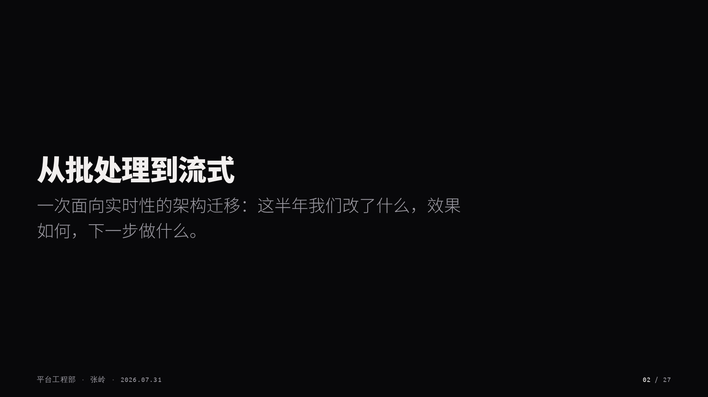

````markdown
---
layout: intro
---

# 从批处理到流式

一次面向实时性的架构迁移：这半年我们改了什么，效果如何，下一步做什么。
````

### `section`

Chapter divider on a full crimson field, with an oversized chapter number.

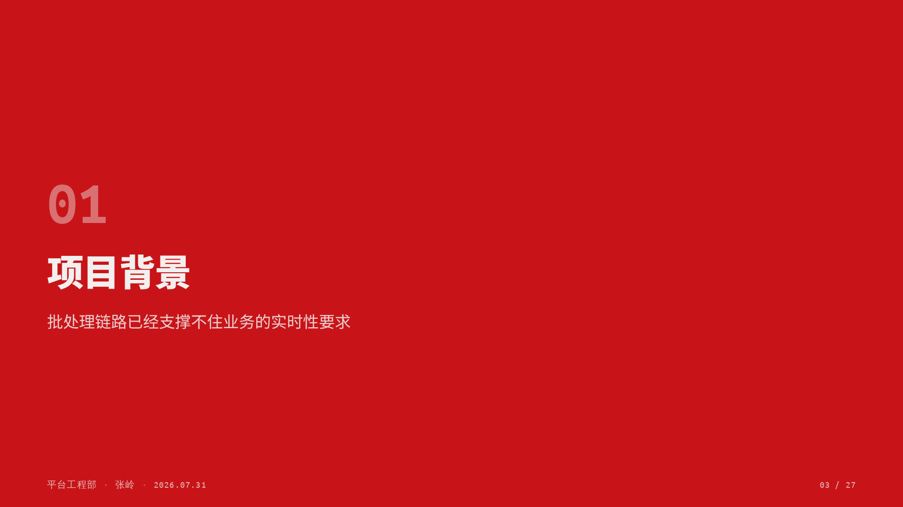

````markdown
---
layout: section
no: "01"
---

## 项目背景

批处理链路已经支撑不住业务的实时性要求
````

### `statement`

A single core claim against an 8px crimson left rule, with three supporting
points beneath a hairline. Wrap the key phrase in `**…**` to accent it.

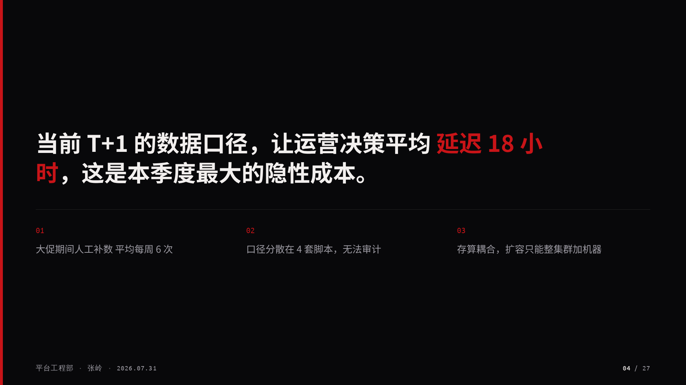

````markdown
---
layout: statement
points:
  - no: "01"
    text: 大促期间人工补数 平均每周 6 次
  - no: "02"
    text: 口径分散在 4 套脚本，无法审计
  - no: "03"
    text: 存算耦合，扩容只能整集群加机器
---

当前 T+1 的数据口径，让运营决策平均 **延迟 18 小时**，这是本季度最大的隐性成本。
````

### `quote`

Pull quote on a surface panel, with an oversized crimson quotation mark and an
attribution rule.

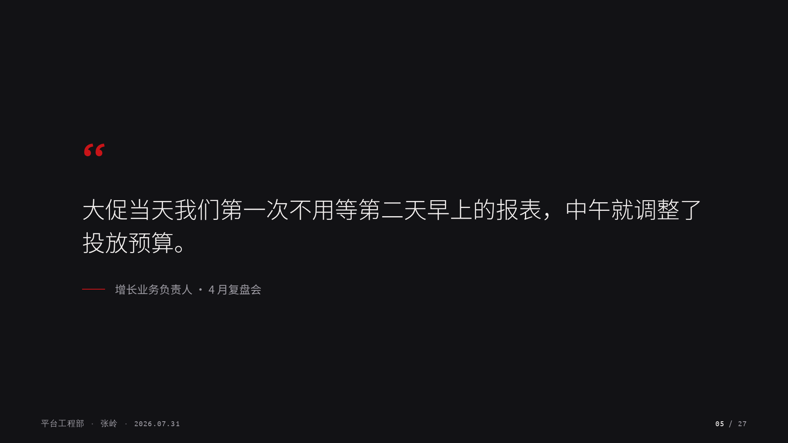

````markdown
---
layout: quote
author: 增长业务负责人 · 4 月复盘会
---

大促当天我们第一次不用等第二天早上的报表，中午就调整了投放预算。
````

### `fact`

Full-crimson emphasis / demo cue: one lucide icon over a big line and a note.
Set `icon: ''` to hide the icon.


````markdown
---
layout: fact
icon: monitor-play
---

## 现场演示

控制台 → 补数请求 → 15 分钟后查询结果
````

### `closing`

Bottom-aligned recap of decisions or asks, with a bottom-left crimson glow and a
two-ended footer.

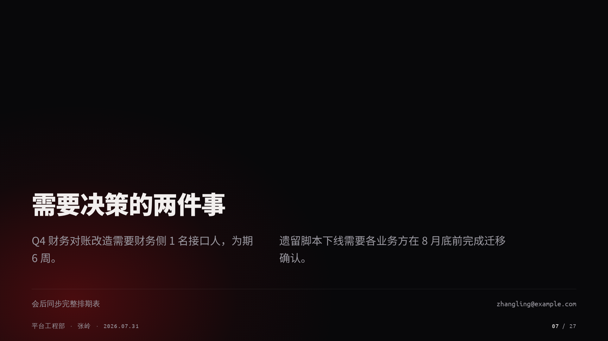

````markdown
---
layout: closing
items:
  - Q4 财务对账改造需要财务侧 1 名接口人，为期 6 周。
  - 遗留脚本下线需要各业务方在 8 月底前完成迁移确认。
footLeft: 会后同步完整排期表
footRight: zhangling@example.com
---

## 需要决策的两件事
````

### `end`

Closing card: one oversized monospace word inside a crimson radial glow.

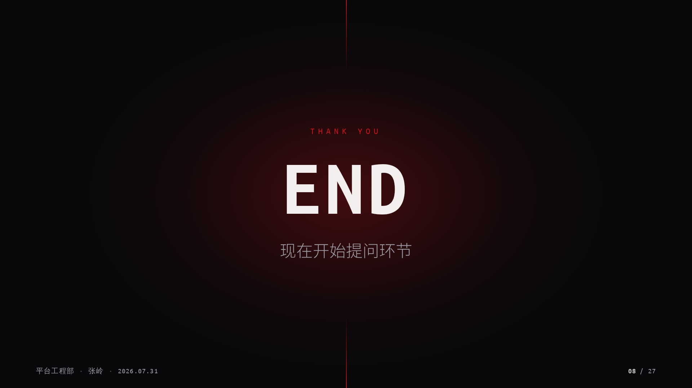

````markdown
---
layout: end
eyebrow: Thank you
big: END
---

现在开始提问环节
````

### `default`

Standard content slide — plain Markdown. Headings, lists, blockquotes and
tables all pick up the theme's typography.

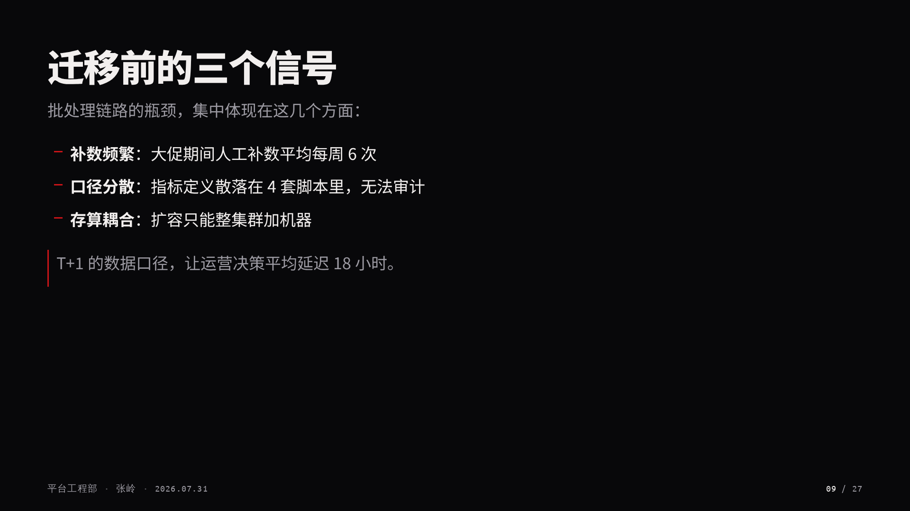

````markdown
---
layout: default
---

# 迁移前的三个信号

批处理链路的瓶颈，集中体现在这几个方面：

- **补数频繁**：大促期间人工补数平均每周 6 次
- **口径分散**：指标定义散落在 4 套脚本里，无法审计
- **存算耦合**：扩容只能整集群加机器

> T+1 的数据口径，让运营决策平均延迟 18 小时。
````

### `agenda`

Two-column table of contents. Fully data-driven — the slide body stays empty.

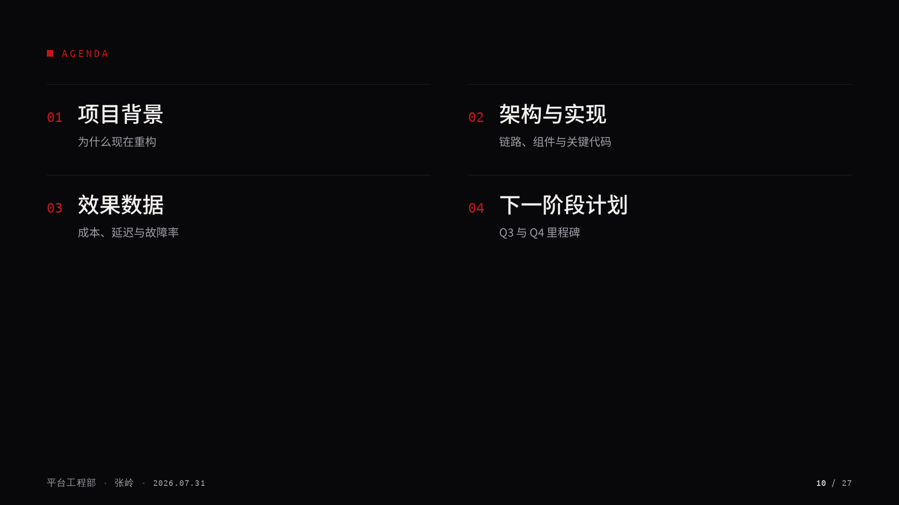

````markdown
---
layout: agenda
kicker: Agenda
items:
  - no: "01"
    title: 项目背景
    desc: 为什么现在重构
  - no: "02"
    title: 架构与实现
    desc: 链路、组件与关键代码
  - no: "03"
    title: 效果数据
    desc: 成本、延迟与故障率
  - no: "04"
    title: 下一阶段计划
    desc: Q3 与 Q4 里程碑
---
````

### `metrics`

A row of equal-height stat cards with a crimson top rule. The heading comes from
a Markdown `##` in the body (or from a `title:` prop).


````markdown
---
layout: metrics
items:
  - value: "-63"
    unit: "%"
    label: 端到端延迟
    note: 18h → 6.7h（P95）
  - value: "-41"
    unit: "%"
    label: 单位存算成本
    note: 按每 TB 处理量折算
  - value: "99.4"
    unit: "%"
    label: 任务成功率
    note: 连续 12 周未出现 P1
---

## 重构半年后的三个变化
````

### `compare`

Before / after columns: the left column is muted, the right one carries the
accent. Both bodies are Markdown, so lists and emphasis work.

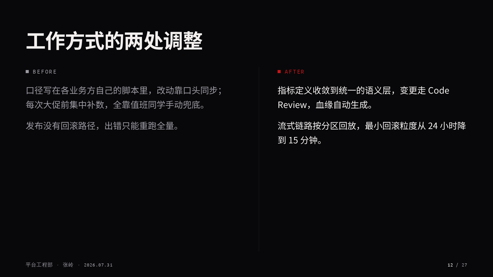

````markdown
---
layout: compare
title: 工作方式的两处调整
leftLabel: Before
rightLabel: After
---

::left::

口径写在各业务方自己的脚本里，改动靠口头同步；每次大促前集中补数，全靠值班同学手动兜底。

发布没有回滚路径，出错只能重跑全量。

::right::

指标定义收敛到统一的语义层，变更走 Code Review，血缘自动生成。

流式链路按分区回放，最小回滚粒度从 24 小时降到 15 分钟。
````

### `roadmap`

Four milestone columns. `active: true` swaps the hairline for a 3px crimson rule
and accents the phase label. Add a `###` line when the slide needs a supporting
description under the title.

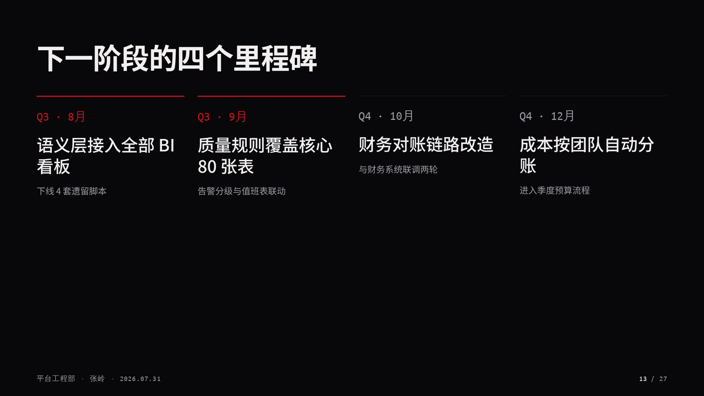

````markdown
---
layout: roadmap
items:
  - phase: Q3 · 8月
    title: 语义层接入全部 BI 看板
    desc: 下线 4 套遗留脚本
    active: true
  - phase: Q3 · 9月
    title: 质量规则覆盖核心 80 张表
    desc: 告警分级与值班表联动
    active: true
  - phase: Q4 · 10月
    title: 财务对账链路改造
    desc: 与财务系统联调两轮
  - phase: Q4 · 12月
    title: 成本按团队自动分账
    desc: 进入季度预算流程
---

## 下一阶段的四个里程碑

### 语义层、质量规则、财务对账与自动分账，按季度推进。
````

### `timeline`

Horizontal timeline on a centered rail. `done: true` fills the marker crimson;
unfinished stages stay outlined and muted.

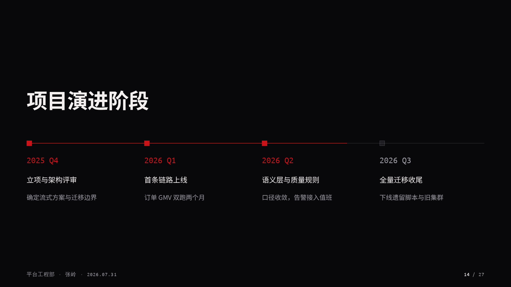

````markdown
---
layout: timeline
items:
  - time: 2025 Q4
    title: 立项与架构评审
    desc: 确定流式方案与迁移边界
    done: true
  - time: 2026 Q1
    title: 首条链路上线
    desc: 订单 GMV 双跑两个月
    done: true
  - time: 2026 Q2
    title: 语义层与质量规则
    desc: 口径收敛，告警接入值班
    done: true
  - time: 2026 Q3
    title: 全量迁移收尾
    desc: 下线遗留脚本与旧集群
    done: false
---

## 项目演进的四个阶段
````

### `steps`

Three process cards, each with a lucide icon, a monospaced step label, a title
and a note. Icons must be safelisted — see [Icons](#icons).

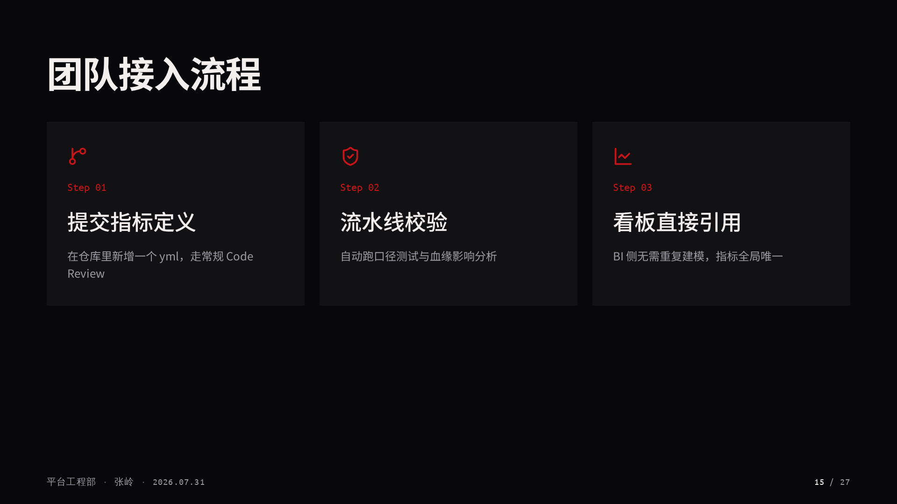

````markdown
---
layout: steps
items:
  - icon: git-branch
    step: Step 01
    title: 提交指标定义
    desc: 在仓库里新增一个 yml，走常规 Code Review
  - icon: shield-check
    step: Step 02
    title: 流水线校验
    desc: 自动跑口径测试与血缘影响分析
  - icon: line-chart
    step: Step 03
    title: 看板直接引用
    desc: BI 侧无需重复建模，指标全局唯一
---

## 团队接入只需要三步
````

### `table`

A Markdown table with an accent header row and zebra body. Use `--:` alignment
on numeric columns — they right-align and switch to the monospaced face.

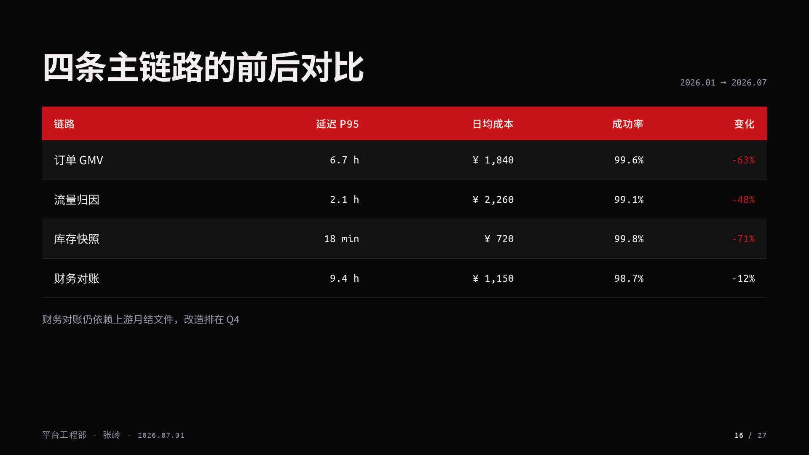

````markdown
---
layout: table
title: 四条主链路的前后对比
meta: 2026.01 → 2026.07
note: 财务对账仍依赖上游月结文件，改造排在 Q4
---

| 链路 | 延迟 P95 | 日均成本 | 成功率 | 变化 |
| :--- | ---: | ---: | ---: | ---: |
| 订单 GMV | 6.7 h | ¥ 1,840 | 99.6% | *-63%* |
| 流量归因 | 2.1 h | ¥ 2,260 | 99.1% | *-48%* |
| 库存快照 | 18 min | ¥ 720 | 99.8% | *-71%* |
| 财务对账 | 9.4 h | ¥ 1,150 | 98.7% | -12% |
````

### `image-full`

Full-bleed hero image with a left→right scrim and a bottom-left caption. Point
`image:` at a real file; leave it out and you get the dashed placeholder below.

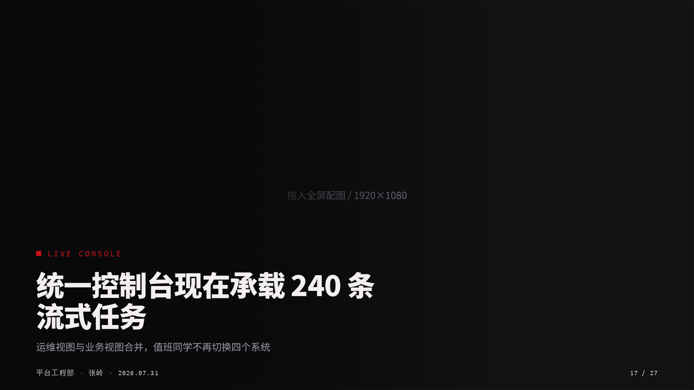

````markdown
---
layout: image-full
# image: /console.png   # uncomment to use a real file instead of the placeholder
kicker: Live Console
title: 统一控制台现在承载 240 条流式任务
desc: 运维视图与业务视图合并，值班同学不再切换四个系统
---
````

### `image-left`

Visual on the left, narrative on the right. The `::image::` slot takes anything —
a screenshot, a Mermaid/PlantUML block, or a `<CDChart>`. `split` sets the grid
columns.

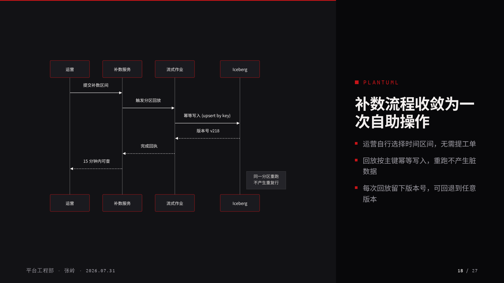

````markdown
---
layout: image-left
split: 2fr 1fr
kicker: PlantUML
bullets:
  - 运营自行选择时间区间，无需提工单
  - 回放按主键幂等写入，重跑不产生脏数据
  - 每次回放留下版本号，可回退到任意版本
---

## 补数流程收敛为一次自助操作

::image::

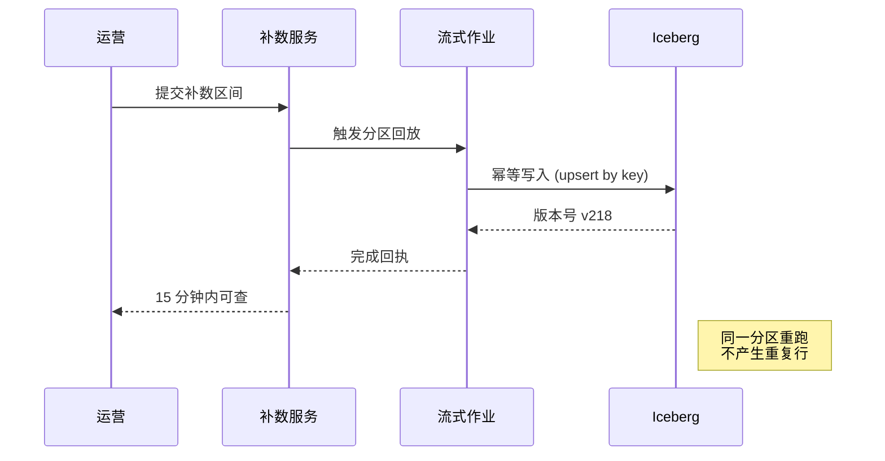
```mermaid
sequenceDiagram
  participant U as 运营
  participant S as 补数服务
  participant J as 流式作业
  participant D as Iceberg
  U->>S: 提交补数区间
  S->>J: 触发分区回放
  J->>D: 幂等写入 (upsert by key)
  D-->>J: 版本号 v218
  J-->>S: 完成回执
  S-->>U: 15 分钟内可查
  Note right of D: 同一分区重跑<br/>不产生重复行
```
````

### `image-right`

Mirror of `image-left`: narrative on the left, visual on the right. The default
slot is plain Markdown, so the kicker is written as `<CDKicker>`.

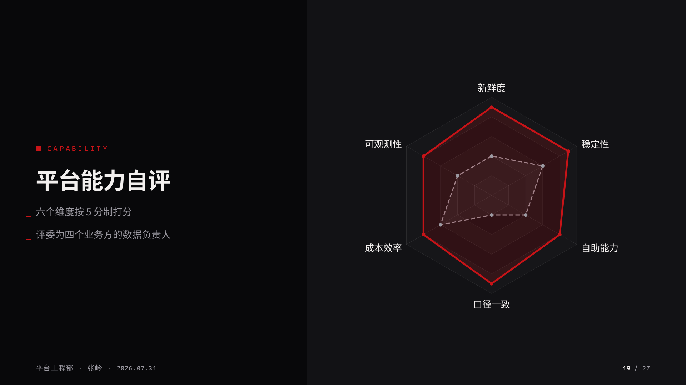

````markdown
---
layout: image-right
---

<CDKicker text="Capability" />

## 平台能力自评

- 六个维度按 5 分制打分
- 评委为四个业务方的数据负责人

::image::

<CDChart type="radar" />
````

### `image-grid`

Three equal-height screenshot tiles with captions. Omit `src` on a tile and it
renders a numbered placeholder.

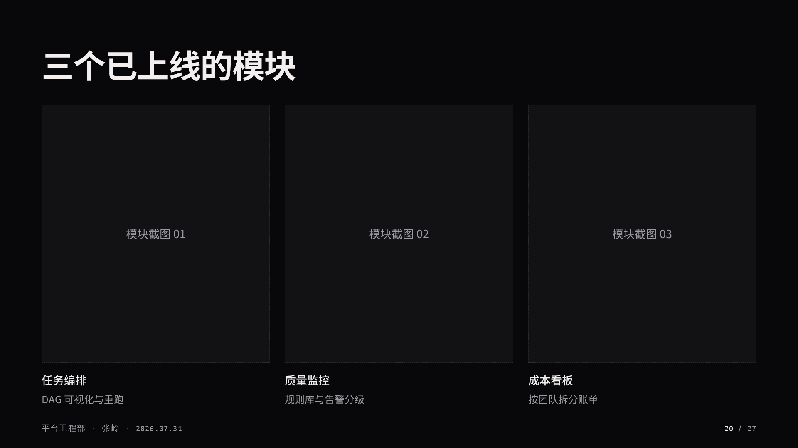

````markdown
---
layout: image-grid
images:
  - title: 任务编排
    desc: DAG 可视化与重跑
  - title: 质量监控
    desc: 规则库与告警分级
  - title: 成本看板
    desc: 按团队拆分账单
---

## 三个已上线的模块
````

### `diagram`

A framed surface for a Mermaid or PlantUML block, with up to three footnotes
underneath. Slidev renders the diagram; the layout only supplies the frame.

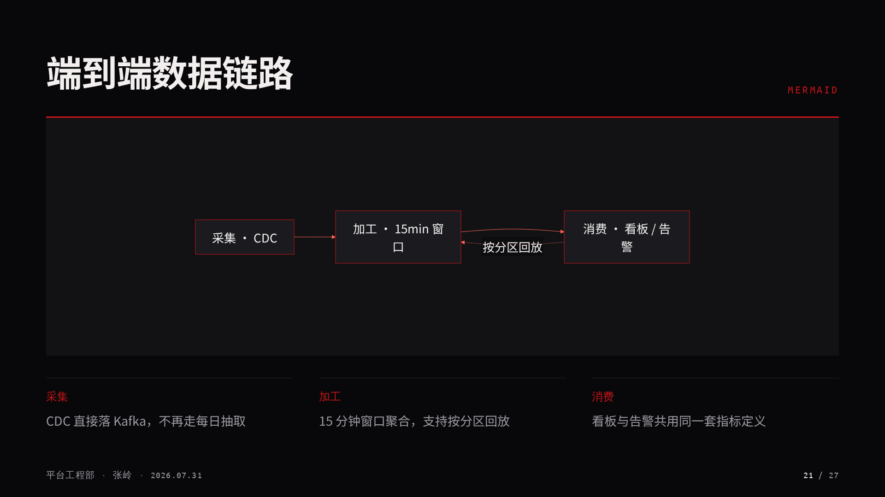

````markdown
---
layout: diagram
title: 端到端数据链路
label: Mermaid
notes:
  - key: 采集
    text: CDC 直接落 Kafka，不再走每日抽取
  - key: 加工
    text: 15 分钟窗口聚合，支持按分区回放
  - key: 消费
    text: 看板与告警共用同一套指标定义
---

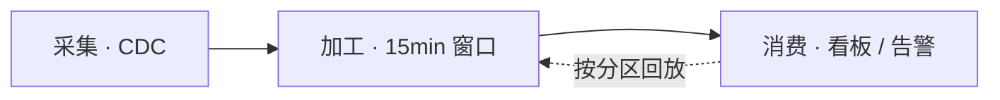
```mermaid
flowchart LR
  A[采集 · CDC] --> B[加工 · 15min 窗口] --> C[消费 · 看板 / 告警]
  C -.按分区回放.-> B
```
````

### `chart`

Full-width themed ECharts. The data props are forwarded to `<CDChart>` — see
[Passing chart data](#passing-chart-data) for the per-type shapes.

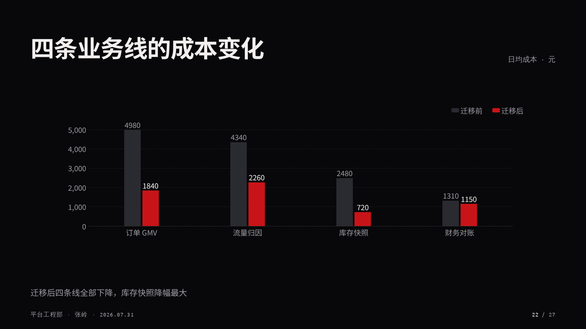

````markdown
---
layout: chart
type: bar
meta: 日均成本 · 元
note: 迁移后四条线全部下降，库存快照降幅最大
categories: [订单 GMV, 流量归因, 库存快照, 财务对账]
series:
  - { name: 迁移前, data: [4980, 4340, 2480, 1310] }
  - { name: 迁移后, data: [1840, 2260, 720, 1150] }
---

## 四条业务线的成本变化
````

### `code`

Full-screen code on a crimson-topped surface, with the filename in the title bar.
Shiki handles the highlighting.

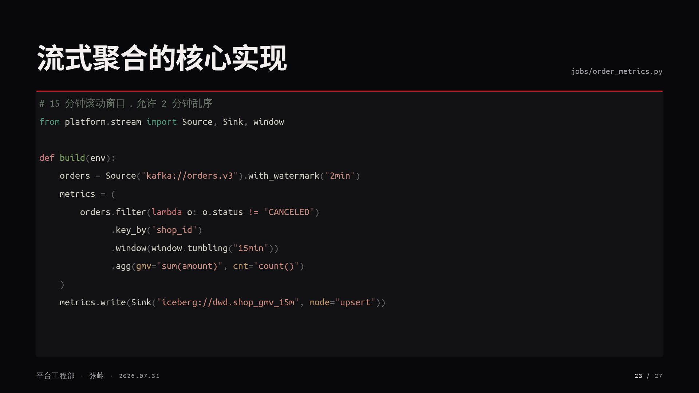

````markdown
---
layout: code
title: 流式聚合的核心实现
file: jobs/order_metrics.py
---

```py
# 15 分钟滚动窗口，允许 2 分钟乱序
from platform.stream import Source, Sink, window

def build(env):
    orders = Source("kafka://orders.v3").with_watermark("2min")
    metrics = (
        orders.filter(lambda o: o.status != "CANCELED")
              .key_by("shop_id")
              .window(window.tumbling("15min"))
              .agg(gmv="sum(amount)", cnt="count()")
    )
    metrics.write(Sink("iceberg://dwd.shop_gmv_15m", mode="upsert"))
```
````

### `code-cols`

Code panel on the left, a field reference on the right. `items[].key` is rendered
in the monospaced accent face, so it reads as a key from the code beside it.


````markdown
---
layout: code-cols
file: metrics/shop_gmv.yml
kicker: Semantic Layer
items:
  - key: grain
    desc: 明确聚合粒度，避免下游重复口径
  - key: freshness_sla
    desc: 超时自动告警到 Owner 群
  - key: tests
    desc: 每次发布前跑一遍，失败即阻断合并
---

## 指标定义变成可审查的代码

::code::

```yml
metric: shop_gmv
source: dwd.shop_gmv_15m
grain: [shop_id, window_start]
expression: sum(gmv)
freshness_sla: 20min
owners: [data-platform, growth]
tests:
  - not_null: [shop_id, gmv]
  - accepted_range: { min: 0 }
```
````

### `team`

Four portrait tiles with a name and an accent role. Omit `photo` and the tile
renders a numbered placeholder.

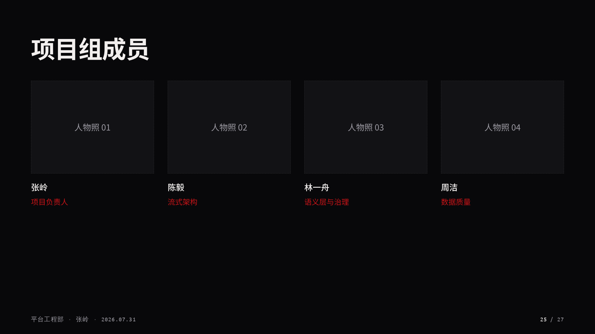

````markdown
---
layout: team
members:
  - name: 张岭
    role: 项目负责人
  - name: 陈毅
    role: 流式架构
  - name: 林一舟
    role: 语义层与治理
  - name: 周洁
    role: 数据质量
---

## 项目组成员
````

### `logos`

A 3×2 logo wall. Each cell shows a contained `` when `src` is set, otherwise
a dashed placeholder labelled by `name`.

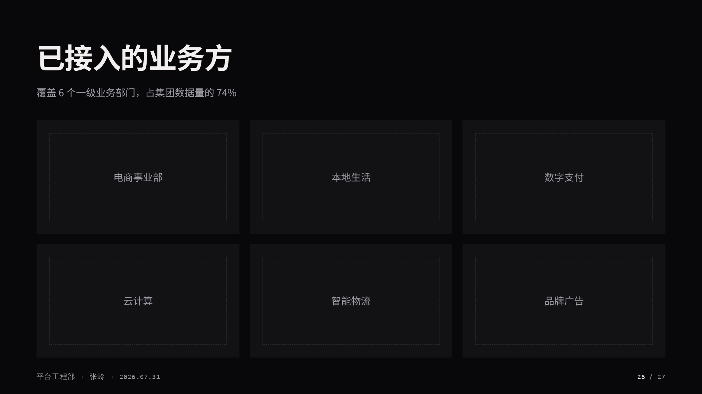

````markdown
---
layout: logos
title: 已接入的业务方
subtitle: 覆盖 6 个一级业务部门，占集团数据量的 74%
logos:
  - name: 电商事业部
  - name: 本地生活
  - name: 数字支付
  - name: 云计算
  - name: 智能物流
  - name: 品牌广告
---
````

### `contact`

Closing contact slide: labelled contact rows on the left, a framed QR panel on
the right. Point `qr:` at an image to replace the placeholder.

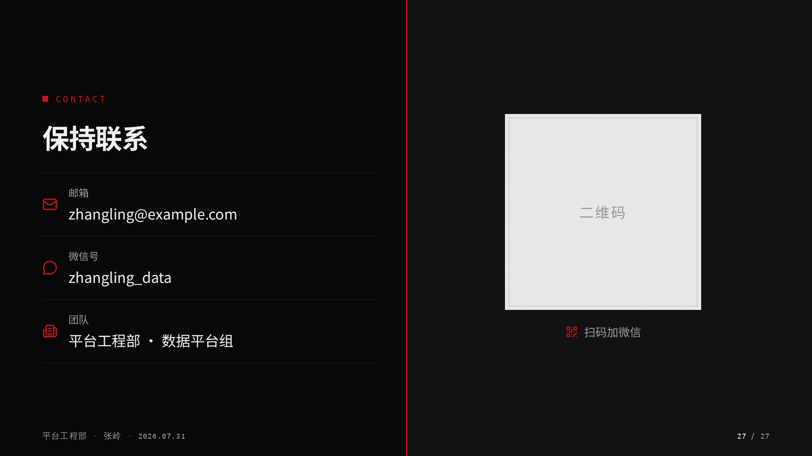

````markdown
---
layout: contact
kicker: Contact
contacts:
  - icon: mail
    label: 邮箱
    value: zhangling@example.com
  - icon: message-circle
    label: 微信号
    value: zhangling_data
  - icon: building-2
    label: 团队
    value: 平台工程部 · 数据平台组
qrCaption: 扫码加微信
---

## 保持联系
````

## Components

Registered globally — use them in any slide without importing.

- **`<CDKicker text="Agenda" />`** — crimson square + monospaced, letter-spaced
  eyebrow label. Also accepts a default slot.
- **`<CDChart type="…" />`** — themed ECharts wrapper. The theme *styling* is
  built in (and follows `themeConfig.primary` — see [Accent color](#accent-color));
  the *data* is yours to pass, so charts are reusable across decks.
  Types: `bar`, `line`, `scatter`, `heatmap`, `sankey` (full-width via the
  `chart` layout) and `pie`, `radar`, `funnel` (in an `image-left` /
  `image-right` `::image::` slot). The host element must have a height.
- **`<CDPageNumber />`** — bottom-right page number (reads the current page).
  Rarely needed now: the [slide footer](#slide-footer) already carries one on
  every slide. Kept for layouts that want a second, differently placed number.

### Passing chart data

Both ways are optional — every chart falls back to built-in sample data.

Via the `chart` layout's frontmatter (full-width charts); the layout forwards
the data props to `CDChart`:

```yaml
---
layout: chart
type: bar
categories: [订单 GMV, 流量归因, 库存快照]
series:
  - { name: 迁移前, data: [4980, 4340, 2480] }
  - { name: 迁移后, data: [1840, 2260, 720] }
---
```

Or directly on `<CDChart>` (e.g. inside an `::image::` slot):

```html
<CDChart type="pie" :data="[{ name: '存储', value: 42 }, { name: '计算', value: 27 }]" />
<CDChart type="sankey" :nodes="[…]" :links="[…]" />
```

Per-type data props (each falls back to sample data when omitted):

| Type | Data props |
| --- | --- |
| `bar` / `line` | `categories`, `series: [{ name, data, dashed?, area? }]` |
| `scatter` | `series: [{ data: [[x,y], …], color? }]` |
| `pie` / `funnel` | `data: [{ name, value, color? }]` |
| `radar` | `indicator: [{ name, max }]`, `series: [{ name, value: number[] }]` |
| `sankey` | `nodes: [{ name, color? }]`, `links: [{ source, target, value }]` |
| `heatmap` | `categories` (x), `yCategories` (y), `data: [[x,y,v], …]` |

For anything else, pass a full/partial ECharts `:option` (deep-merged over the
themed preset).

## Icons

Layouts render [Lucide](https://lucide.dev) icons via UnoCSS classes like
`i-lucide-git-branch`. Because these names are dynamic, they can't be discovered
by static analysis, so [`uno.config.ts`](./uno.config.ts) safelists the icons the
demo uses plus common ones. **If you reference another lucide icon, add its
`i-lucide-<name>` to the safelist** (or write the static class directly).

## Notes on `title:`

`title` is a reserved Slidev frontmatter field: Slidev consumes it for the TOC
and the document title, and strips it before binding the frontmatter to the
layout. Layouts here read it back from the untouched `frontmatter` object via
[`composables/useSlideTitle.ts`](./composables/useSlideTitle.ts), so `title:` and
a Markdown `##` heading are interchangeable wherever both are listed above.

## Contributing

- `pnpm install`
- `pnpm dev` — start the `example.md` preview (a full deck)
- `pnpm dev:gallery` — start the `gallery.md` preview (one slide per layout)
- Edit `example.md`, `gallery.md`, `layouts/*`, `styles/*` and watch changes live
- `pnpm build` — build the demo as a static SPA
- `pnpm export` / `pnpm screenshot` — export PDF / PNGs
- `pnpm screenshot:preview` — re-export the README preview table into `assets/`
- `pnpm screenshot:layouts` — re-export the gallery images into `assets/layouts/`
  (needs `playwright-chromium`; Slidev prompts to install it on first run)
- `pnpm screenshot:accents` — re-export the custom-primary images into `assets/accent/`
- `pnpm screenshot:all` — all three, which is what a visual change to the theme needs

Learn more about writing themes: <https://sli.dev/guide/write-theme>
