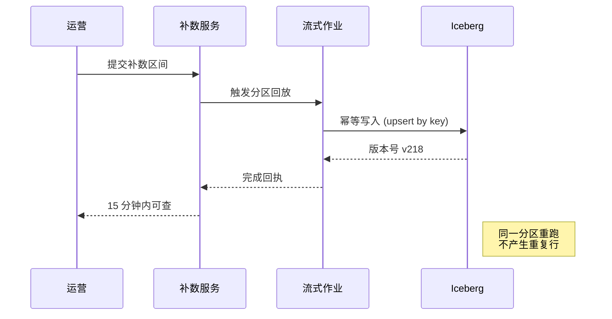

# 数据平台重构<br>中期进展与下一阶段计划

从批处理迁移到流式架构：成本、稳定性与交付节奏

---
layout: intro
---

# 从批处理到流式

一次面向实时性的架构迁移：这半年我们改了什么，效果如何，下一步做什么。

---
layout: agenda
kicker: Agenda
items:
  - no: "01"
    title: 项目背景
    desc: 为什么现在重构
  - no: "02"
    title: 架构与实现
    desc: 链路、组件与关键代码
  - no: "03"
    title: 效果数据
    desc: 成本、延迟与故障率
  - no: "04"
    title: 下一阶段计划
    desc: Q3 与 Q4 里程碑
---

---
layout: section
no: "01"
---

## 项目背景

批处理链路已经支撑不住业务的实时性要求

---
layout: default
---

# 迁移前的三个信号

批处理链路的瓶颈，集中体现在这几个方面：

- **补数频繁**：大促期间人工补数平均每周 6 次
- **口径分散**：指标定义散落在 4 套脚本里，无法审计
- **存算耦合**：扩容只能整集群加机器

> T+1 的数据口径，让运营决策平均延迟 18 小时。

---
layout: statement
points:
  - no: "01"
    text: 大促期间人工补数 平均每周 6 次
  - no: "02"
    text: 口径分散在 4 套脚本，无法审计
  - no: "03"
    text: 存算耦合，扩容只能整集群加机器
---

当前 T+1 的数据口径，让运营决策平均 **延迟 18 小时**，这是本季度最大的隐性成本。

---
layout: metrics
items:
  - value: "-63"
    unit: "%"
    label: 端到端延迟
    note: 18h → 6.7h（P95）
  - value: "-41"
    unit: "%"
    label: 单位存算成本
    note: 按每 TB 处理量折算
  - value: "99.4"
    unit: "%"
    label: 任务成功率
    note: 连续 12 周未出现 P1
---

## 重构半年后的三个变化

---
layout: compare
title: 工作方式的两处调整
leftLabel: Before
rightLabel: After
---

::left::

口径写在各业务方自己的脚本里，改动靠口头同步；每次大促前集中补数，全靠值班同学手动兜底。

发布没有回滚路径，出错只能重跑全量。

::right::

指标定义收敛到统一的语义层，变更走 Code Review，血缘自动生成。

流式链路按分区回放，最小回滚粒度从 24 小时降到 15 分钟。

---
layout: image-full
kicker: Live Console
title: 统一控制台现在承载 240 条流式任务
desc: 运维视图与业务视图合并，值班同学不再切换四个系统
---

<!-- 全屏配图：把 image 字段指向真实图片即可，留空显示占位框 -->

---
layout: image-right
---

<CDKicker text="Data Lineage" />

## 血缘图谱把排查时间压到 10 分钟内

- 上游表变更自动标记受影响的 137 个下游模型
- 异常节点直接跳转到对应的任务日志与提交记录
- 口径变更需要下游 Owner 确认后才能合并

::image::

<CDChart type="sankey" />

---
layout: image-grid
images:
  - title: 任务编排
    desc: DAG 可视化与重跑
  - title: 质量监控
    desc: 规则库与告警分级
  - title: 成本看板
    desc: 按团队拆分账单
---

## 三个已上线的模块

---
layout: section
no: "02"
---

## 架构与实现

语义层与流式回放，两个组件承担了大部分改造量

---
layout: diagram
title: 端到端数据链路
label: Mermaid
notes:
  - key: 采集
    text: CDC 直接落 Kafka，不再走每日抽取
  - key: 加工
    text: 15 分钟窗口聚合，支持按分区回放
  - key: 消费
    text: 看板与告警共用同一套指标定义
---


---
layout: image-left
split: 2fr 1fr
kicker: PlantUML
bullets:
  - 运营自行选择时间区间，无需提工单
  - 回放按主键幂等写入，重跑不产生脏数据
  - 每次回放留下版本号，可回退到任意版本
---

## 补数流程收敛为一次自助操作

::image::



---
layout: code
title: 流式聚合的核心实现
file: jobs/order_metrics.py
---

```py
# 15 分钟滚动窗口，允许 2 分钟乱序
from platform.stream import Source, Sink, window

def build(env):
    orders = Source("kafka://orders.v3").with_watermark("2min")
    metrics = (
        orders.filter(lambda o: o.status != "CANCELED")
              .key_by("shop_id")
              .window(window.tumbling("15min"))
              .agg(gmv="sum(amount)", cnt="count()")
    )
    metrics.write(Sink("iceberg://dwd.shop_gmv_15m", mode="upsert"))
```

---
layout: code-cols
file: metrics/shop_gmv.yml
kicker: Semantic Layer
items:
  - key: grain
    desc: 明确聚合粒度，避免下游重复口径
  - key: freshness_sla
    desc: 超时自动告警到 Owner 群
  - key: tests
    desc: 每次发布前跑一遍，失败即阻断合并
---

## 指标定义变成可审查的代码

::code::

```yml
metric: shop_gmv
source: dwd.shop_gmv_15m
grain: [shop_id, window_start]
expression: sum(gmv)
freshness_sla: 20min
owners: [data-platform, growth]
tests:
  - not_null: [shop_id, gmv]
  - accepted_range: { min: 0 }
```

---
layout: section
no: "03"
---

## 效果数据

对比 1 月基线，统计口径为近 12 周均值

---
layout: table
title: 四条主链路的前后对比
meta: 2026.01 → 2026.07
note: 财务对账仍依赖上游月结文件，改造排在 Q4
---

| 链路 | 延迟 P95 | 日均成本 | 成功率 | 变化 |
| :--- | ---: | ---: | ---: | ---: |
| 订单 GMV | 6.7 h | ¥ 1,840 | 99.6% | *-63%* |
| 流量归因 | 2.1 h | ¥ 2,260 | 99.1% | *-48%* |
| 库存快照 | 18 min | ¥ 720 | 99.8% | *-71%* |
| 财务对账 | 9.4 h | ¥ 1,150 | 98.7% | -12% |

---
layout: quote
author: 增长业务负责人 · 4 月复盘会
---

大促当天我们第一次不用等第二天早上的报表，中午就调整了投放预算。

---
layout: chart
type: bar
meta: 日均成本 · 元
note: 迁移后四条线全部下降，库存快照降幅最大
categories: [订单 GMV, 流量归因, 库存快照, 财务对账]
series:
  - { name: 迁移前, data: [4980, 4340, 2480, 1310] }
  - { name: 迁移后, data: [1840, 2260, 720, 1150] }
---

## 四条业务线的成本变化

---
layout: image-left
kicker: Cost Split
bullets:
  - 存储仍占 42%，主要来自双跑期间保留的旧表
  - Q3 下线后预计再降 12%
---

## 成本构成

::image::

<CDChart type="pie" :data="[{ name: '存储', value: 42 }, { name: '计算', value: 27 }, { name: '流式集群', value: 18 }, { name: '其他', value: 13 }]" />

---
layout: chart
type: line
meta: 2026.01 – 2026.07
note: 4 月上线语义层后，两条曲线同步下降并趋于平稳
categories: [1月, 2月, 3月, 4月, 5月, 6月, 7月]
series:
  - { name: P95 延迟 (h), data: [18, 16.4, 13.1, 10.2, 8.4, 7.1, 6.7] }
  - { name: P1 故障数, data: [6, 5, 4, 2, 1, 0, 0] }
---

## 延迟与故障数的月度趋势

---
layout: chart
type: scatter
meta: 每点 = 一个流式任务
note: 大任务不再显著更慢，瓶颈已从计算转移到上游写入
---

## 任务规模与延迟的关系

---
layout: image-right
---

<CDKicker text="Capability" />

## 平台能力自评

- 六个维度按 5 分制打分
- 评委为四个业务方的数据负责人

::image::

<CDChart type="radar" />

---
layout: chart
type: heatmap
meta: 近 12 周累计次数
note: 周一 08–10 点最集中，与上游月初批量写入重叠
---

## 告警分布：按星期与时段

---
layout: chart
type: sankey
meta: 日均 · TB
note: 四成流量在明细层就被聚合收敛，进入看板的仅剩 12 TB
---

## 数据量在各层的流向

---
layout: image-left
kicker: Onboarding
bullets:
  - 上半年共 86 个团队咨询接入，最终 31 个完成迁移并上线
  - 流失主要发生在「完成改造」，卡点是历史口径核对
---

## 业务方接入转化

::image::

<CDChart type="funnel" />

---
layout: roadmap
items:
  - phase: Q3 · 8月
    title: 语义层接入全部 BI 看板
    desc: 下线 4 套遗留脚本
    active: true
  - phase: Q3 · 9月
    title: 质量规则覆盖核心 80 张表
    desc: 告警分级与值班表联动
    active: true
  - phase: Q4 · 10月
    title: 财务对账链路改造
    desc: 与财务系统联调两轮
  - phase: Q4 · 12月
    title: 成本按团队自动分账
    desc: 进入季度预算流程
---

## 下一阶段的四个里程碑

### 语义层、质量规则、财务对账与自动分账，按季度推进。

---
layout: timeline
items:
  - time: 2025 Q4
    title: 立项与架构评审
    desc: 确定流式方案与迁移边界
    done: true
  - time: 2026 Q1
    title: 首条链路上线
    desc: 订单 GMV 双跑两个月
    done: true
  - time: 2026 Q2
    title: 语义层与质量规则
    desc: 口径收敛，告警接入值班
    done: true
  - time: 2026 Q3
    title: 全量迁移收尾
    desc: 下线遗留脚本与旧集群
    done: false
---

## 项目演进的四个阶段

---
layout: steps
items:
  - icon: git-branch
    step: Step 01
    title: 提交指标定义
    desc: 在仓库里新增一个 yml，走常规 Code Review
  - icon: shield-check
    step: Step 02
    title: 流水线校验
    desc: 自动跑口径测试与血缘影响分析
  - icon: line-chart
    step: Step 03
    title: 看板直接引用
    desc: BI 侧无需重复建模，指标全局唯一
---

## 团队接入只需要三步

---
layout: fact
icon: monitor-play
---

## 现场演示

控制台 → 补数请求 → 15 分钟后查询结果

---
layout: team
members:
  - name: 张岭
    role: 项目负责人
  - name: 陈毅
    role: 流式架构
  - name: 林一舟
    role: 语义层与治理
  - name: 周洁
    role: 数据质量
---

## 项目组成员

---
layout: logos
subtitle: 覆盖 6 个一级业务部门，占集团数据量的 74%
logos:
  - name: 电商事业部
  - name: 本地生活
  - name: 数字支付
  - name: 云计算
  - name: 智能物流
  - name: 品牌广告
---

## 已接入的业务方

---
layout: closing
items:
  - Q4 财务对账改造需要财务侧 1 名接口人，为期 6 周。
  - 遗留脚本下线需要各业务方在 8 月底前完成迁移确认。
footLeft: 会后同步完整排期表
footRight: zhangling@example.com
---

## 需要决策的两件事

---
layout: contact
kicker: Contact
contacts:
  - icon: mail
    label: 邮箱
    value: zhangling@example.com
  - icon: message-circle
    label: 微信号
    value: zhangling_data
  - icon: building-2
    label: 团队
    value: 平台工程部 · 数据平台组
qrCaption: 扫码加微信
---

## 保持联系

---
layout: end
eyebrow: Thank you
big: END
---

现在开始提问环节
